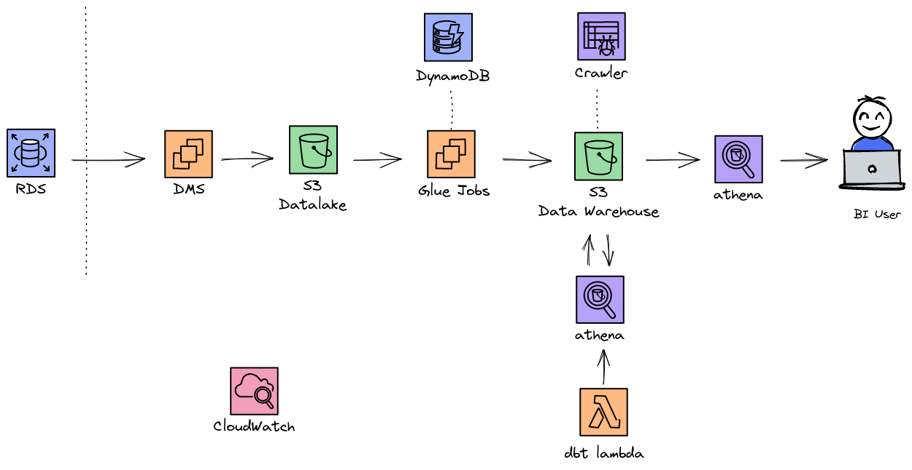

# Refera Challenge

## O desafio

O que deve ser feito: Uma ETL para construção de um DW que consiga responder, da forma mais eficiente possível, às perguntas apresentadas. 

### Banco para extração dos dados:

- Dump do banco: https://drive.google.com/file/d/1o2KM3V6k23qRRQanM6d82p4VXuuuyinv/view?usp=sharing
- Modelagem do transacional: https://www.mysqltutorial.org/wp-content/uploads/2018/04/MySQL-Sample-Database-Diagram-PDF-A4.pdf
- Os dados foram salvos em um dump. Você pode subir os dados em um banco de preferência. Lembre-se de que ele será o "transacional" do desafio, portanto deve ser usado apenas para extrair e não tratar os dados.

### Stack de ferrametas:
- Banco transacional para restaurar o dump: Você escolhe
- Ferramenta de ETL: Glue ou Lambda
- Storage: S3
- Scheduler: Você escolhe

### Requisitos:
- Extração incremental de dados;
- Criar uma camada de dados extraídos(Data lake) e uma camada processada(Data Warehouse)
- Agendado para rodar todos os dias (não precisa deixar ativado e rodando);
- Ser possível colocar pra rodar durante a apresentação;
- Seguir nos dados processados e modelados uma modelagem estrela, com fatos e dimensões;
- Ser possível responder as perguntas de negócio levantadas (é possível responder outras não levantadas);
- Subir código no github.

Com forma de guia, seguem abaixo as perguntas de negócio que precisam ser respondidas com o DW (não é necessário fazer a análise depois ou os SQLs de resposta para essas perguntas):
- Valor total das vendas por produto, linha de produto, data de venda, etc
- Valor de venda por vendedor
- Média dos pagamentos de cada cliente por data
- Venda por cliente e por status
- Tempo para envio de um pedido
- Quantidade de venda por gerente, cidade do cliente e cidade do escritório
- Quantidade em estoque por produto e mês


----------------------------------------------------------------------------------------

## Arquitetura da solução

O desenho da solução completa:




## Extract - Load

Para a extração dos dados no banco transacional (RDS - MySQL) foi utilizado a pipeline descrita no artigo [Load ongoing data lake changes with AWS DMS and AWS Glue](https://aws.amazon.com/blogs/big-data/loading-ongoing-data-lake-changes-with-aws-dms-and-aws-glue/).

Os dados são extraidos atravês do DMS pelo método de leitura de logs do banco de dados (CDC - Change Data Capture) e colocados no bucket raw de forma incremental.

Os dados raw são processados pelo AWS Glue e entregues no bucket data-warehouse.


A infra foi adaptada para ser declarada pelo terraform.

## Tranformação

Confira o repositório contendo as transformações de negócio: [dbt_refera_challenge](https://github.com/cidraljunior/dbt_refera_challenge)

## Deploy

1. Para a criação/atualização da infra rode o terraform plan para revisar os recursos a serem criados:

```bash
make terraform_plan
```

2. Confirme a criação dos recursos.

```bash
make terraform_apply
```

